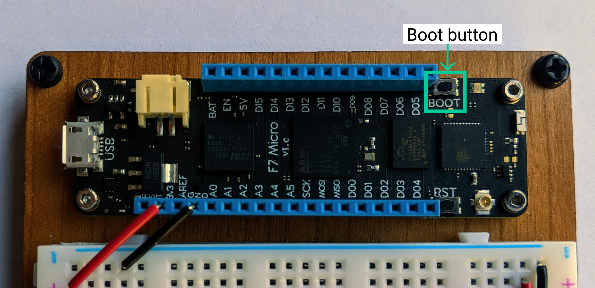

When you receive your Meadow board, it will need to have the latest Meadow.OS uploaded, or _flashed_, to it.

## Prerequisites

### Windows
* Install [.NET 5.0 SDK](https://dotnet.microsoft.com/download)
* [Update USB driver for ST devices](/Meadow/Getting_Started/Update_USB_Driver/)
* Install Meadow CLI:

```
dotnet tool install WildernessLabs.Meadow.CLI --global
```

### macOS
* You will need to run the upcoming commands from within a `bash` shell, rather than the default `zsh` shell.
* Install [.NET 5.0 SDK](https://dotnet.microsoft.com/download)
* Install Meadow CLI:

```
dotnet tool install WildernessLabs.Meadow.CLI --global
```

### Linux (Debian, Ubuntu)
* Install [.NET 5.0 SDK](https://dotnet.microsoft.com/download)
* Install Meadow.CLI:

```
dotnet tool install WildernessLabs.Meadow.CLI
```


### Common
* Install Meadow.CLI:

```
dotnet tool install WildernessLabs.Meadow.CLI --global
```

* Or update a previous version:

```
dotnet tool update WildernessLabs.Meadow.CLI --global
```


### Windows
* Install dfu-util:

```
meadow install dfu-util
```

### macOS
* Install dfu-util:

```
brew install dfu-util
```

### Linux (Debian, Ubuntu)
* Install dfu-util:

```
sudo apt-get install dfu-util
```

* Install libusb :

```
sudo apt-get install libusb-1.0-0-dev
```

You can follow this detailed step by step guide for both macOS and Windows:

## Step 1: Download Meadow OS and network binaries

```
meadow download os
```

## Step 2: Put the device into DFU Bootloader mode.

To update the OS, Meadow must be in _DFU bootloader_ mode. To enter this mode, the `BOOT` button needs to be held down while the board boots up. This can be accomplished one of two ways.

**If the board is disconnected:** hold the `BOOT` button down and connect the board to your computer via a Micro USB Cable.

{:standalone}

**If the board is connected:** hold the `BOOT` button down, and then press and release the `RST` (Reset) button. Then release the `BOOT` button. 

**Linux (Debian, Ubuntu)** 
1. To be able to access the device a udev rule needs to be added.  
* Go to the folder `/etc/udev/rules.d`
* Create the file `50-meadow.rules`
* Add the following to the file:

```
SUBSYSTEM=="usb", ATTR{idProduct}=="df11", ATTR{idVendor}=="0483", MODE="0666", GROUP="user", TAG+="uaccess"
```
* To verify the Product ID and Vendor ID execute the command:

```
lsusb
```
* You should be able to find a entry similar to the following:

```
Bus 001 Device 009: ID 0483:df11 STMicroelectronics STM Device in DFU Mode
```
* The format for the IDs is `idVendor:idProduct`.
2. Now disconnect and reconnect the Meadow to make the rules take affect.

## Step 3 (Option 1): Flash Meadow.OS and Coprocessor Firmware from bootloader mode

1. Flash the main Meadow.OS:

```
meadow flash os
```

## Step 3 (Option 2): Flash Meadow.OS and Coprocessor Firmware from normal mode

This following will only work if you have a newer version of Meadow OS installed. It is recommended to try option 1 first.

Reset the device (push the RST button or disconnect and reconnect) and identify the serial port name that the Meadow is connecting on:

**Windows**

* On Windows, serial port name looks something like *COM5*. To locate, open *Device Manager*; the Meadow device should show up as *USB Serial Device [COMXX]*:  

{:standalone} 

**Mac**

* Run the following from terminal:

```
ls /dev/tty.usb*
```
* The port should be something like `/dev/tty.usbmodem01`.

**Linux (Debian, Ubuntu)** 
1. To get acces to the port your user needs to be added to the group `dialout`.  
    This is done with the command:

```
sudo adduser your_user dialout
```
Replace `your_user` with the user name. You need to **logout and login** again to make the changes affect.
2. To find the Port where the Meadow is connected execute

```
ls -l /dev
```  
look for

```
ttyAMC0
```
or similar. The port might change between reboots of the Meadow so make sure to check it after a reboot. If you can't detect which port the meadow belongs to run the command once with the Meadow disconnected and once with the Meadow connected to spot the difference.

2. Once you've identified the port name, run the following, replacing `[PORT]` with the serial port name:

```
meadow flash os -s [PORT]
```

**NOTE: If the process hangs on *Opening port '[PORT]'...*, hit the RST button on the device.**

3. Unplug and replug Meadow to give it a full restart.

Your board is now ready to have a Meadow application deployed to it!

#### Notes:

 * Linux may require `sudo` to access USB devices.

## [Next - Hello, Meadow](/Meadow/Getting_Started/Hello_World/)
