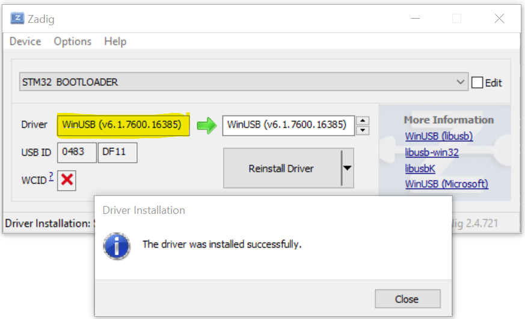

When you receive your Meadow board, it will need to have the latest Meadow.OS uploaded, or _flashed_, to it.

## Go to the instructions for your development system
1. [Windows](#windows)
2. [macOS](#macos)
3. [Linux (Debian, Ubuntu)](#linux-debian-ubuntu)

## Windows

[//]: # (Whenever editing these OS sections, make sure any common instructions are edited in the other OS sections as well to keep them in sync with each other.)

### Install .NET SDK

Download and install the latest [.NET 6 SDK](https://dotnet.microsoft.com/en-us/download/dotnet/6.0).

### Install or update Meadow CLI
To install Meadow CLI, execute the following command in your console:

```console
dotnet tool install WildernessLabs.Meadow.CLI --global
```

To update Meadow CLI, if already installed, execute the following command in your console:

```console
dotnet tool update WildernessLabs.Meadow.CLI --global
```

### Install dfu-util
From a console with admin rights, execute following command:

```console
meadow install dfu-util
```

### Update USB driver for ST devices

In order to flash Meadow OS, *dfu-util* is recommended. However, the default Windows USB driver for ST devices is not compatible with *dfu-util*, so it needs to be replaced. For more in-depth information on this, check out [Scott Hanselman's post](https://www.hanselman.com/blog/how-to-fix-dfuutil-stm-winusb-zadig-bootloaders-and-other-firmware-flashing-issues-on-windows). 

1. Download and run [Zadig](https://zadig.akeo.ie/)
1. Connect a Meadow device in bootloader mode
1. In Zadig, click *Options* > *List All Devices*
1. Select *STM32 BOOTLOADER* in the dropdown
1. Click *Replace Driver*

    {:standalone}

1. After the installation is complete, driver should be *WinUSB*

    {:standalone}

### Download Meadow OS and network binaries
Execute the following command in your console:

```console
meadow download os
```

### Put the device into DFU Bootloader mode.
To update the OS, Meadow must be in _DFU bootloader_ mode. To enter this mode, the `BOOT` button needs to be held down while the board boots up. This can be accomplished one of two ways.

**If the board is disconnected:** hold the `BOOT` button down and connect the board to your computer via a Micro USB Cable.

**If the board is connected:** hold the `BOOT` button down, and then press and release the `RST` (Reset) button. Then release the `BOOT` button. 


### Flash Meadow.OS and Coprocessor Firmware
Now you have two options, please try option 1 first:

#### Option 1 (from bootloader mode) 
Once connected the Meadow device via the USB cable and having put the device into DFU Bootloader mode, execute the following command in your console:

```console
meadow flash os
```

#### Option 2 (from normal mode)
This following will only work if you have a newer version of Meadow OS installed. It is recommended to try option 1 first.
Reset the device (push the RST button or disconnect and reconnect) and identify the serial port name that the Meadow is connecting on.

* Open *Device Manager*; the Meadow device should show up as *USB Serial Device [COMXX]*:  


Once you've identified the port name, run the following command in your console replacing [PORT] with the serial port name:

```console
meadow flash os -s [PORT]
```

**NOTE: If the process hangs on _Opening port '[PORT]'..._, hit the RST button on the device.**

Unplug and reconnect the Meadow board to give it a full restart.
Your board is now ready to have a Meadow application deployed to it!

## macOS

[//]: # (Whenever editing these OS sections, make sure any common instructions are edited in the other OS sections as well to keep them in sync with each other.)

### Install .NET SDK

Download and install the latest [.NET 6 SDK](https://dotnet.microsoft.com/en-us/download/dotnet/6.0) for your Mac's processor architecture.

Even if you are working on an ARM-based computer, such as Apple M1, M1 Pro, or M2 CPUs, you should still install the x86 version of the .NET SDK.

### Install or update Meadow CLI
To install Meadow CLI, execute the following command in your terminal:

```console
dotnet tool install WildernessLabs.Meadow.CLI --global
```

To update Meadow CLI, if already installed, execute the following command in your terminal:

```console
dotnet tool update WildernessLabs.Meadow.CLI --global
```

### Install dfu-util

To install `dfu-util`, we'll be using **Homebrew**. If you don't have it yet, [install Homebrew](https://brew.sh/) first.

Execute the following command in your terminal:

```console
brew install dfu-util
```

### Download Meadow OS and network binaries

Execute the following command in your terminal:

```console
meadow download os
```

**NOTE: If the `meadow` command returns an error: command not found:**

If your terminal cannot find the `meadow` command, it means the .NET SDK didn't add the global tool installation location to your shell's `PATH` variable. Run the following command to add that location to your `PATH` variable so your terminal knows where to find the `meadow` command. Then run the OS download command from above one more time.

```console
export PATH="$PATH:$HOME/.dotnet/tools"
```

### Put the device into DFU Bootloader mode.
To update the OS, Meadow must be in _DFU bootloader_ mode. To enter this mode, the `BOOT` button needs to be held down while the board boots up. This can be accomplished one of two ways.

**If the board is disconnected:** hold the `BOOT` button down and connect the board to your computer via a Micro USB Cable.

**If the board is connected:** hold the `BOOT` button down, and then press and release the `RST` (Reset) button. Then release the `BOOT` button. 


### Flash Meadow.OS and Coprocessor Firmware
Now you have two options, please try the option 1 first:

#### Option 1 (from bootloader mode) 
Once connected the Meadow device via the USB cable and having put the device into DFU Bootloader mode, execute the following command in your terminal:

```console
meadow flash os
```

#### Option 2 (from normal mode)
This following will only work if you have a newer version of Meadow OS installed. It is recommended to try option 1 first.
Reset the device (push the RST button or disconnect and reconnect) and identify the serial port name that the Meadow is connecting on.

Execute the following command in your terminal:

```console
ls /dev/tty.usb*
```

The port should be something like `/dev/tty.usbmodem01`.
Once you've identified the port name, run the following command in your console replacing [PORT] with the serial port name:

```console
meadow flash os -s [PORT]
```

**NOTE: If the process hangs on _Opening port '[PORT]'..._, hit the RST button on the device.**

Unplug and replug Meadow to give it a full restart.
Your board is now ready to have a Meadow application deployed to it!

## Linux (Debian, Ubuntu)

[//]: # (Whenever editing these OS sections, make sure any common instructions are edited in the other OS sections as well to keep them in sync with each other.)

Please note: Linux may require `sudo` to access USB devices.

### Install .NET SDK

Download and install the latest [.NET 6 SDK](https://dotnet.microsoft.com/en-us/download/dotnet/6.0).

### Install or update Meadow CLI
To install Meadow CLI, execute the following command in your terminal:

```console
dotnet tool install WildernessLabs.Meadow.CLI --global
```

To update Meadow CLI, if already installed, execute the following command in your terminal:

```console
dotnet tool update WildernessLabs.Meadow.CLI --global
```

### Install dfu-util
Execute the following command in your terminal:

```console
sudo apt-get install dfu-util
```

### Install libusb
Execute the following command in your terminal:

```console
sudo apt-get install libusb-1.0-0-dev
```

### Download Meadow OS and network binaries
Execute the following command in your terminal:

```console
meadow download os
```

### Put the device into DFU Bootloader mode.
To update the OS, Meadow must be in _DFU bootloader_ mode. To enter this mode, the `BOOT` button needs to be held down while the board boots up. This can be accomplished one of two ways.

**If the board is disconnected:** hold the `BOOT` button down and connect the board to your computer via a Micro USB Cable.

**If the board is connected:** hold the `BOOT` button down, and then press and release the `RST` (Reset) button. Then release the `BOOT` button. 


### Enable access to the device
To be able to access the device a udev rule needs to be added.  
* Go to the folder `/etc/udev/rules.d`
* Create the file `50-meadow.rules`
* Add the following to the file:

```console
SUBSYSTEM=="usb", ATTR{idProduct}=="df11", ATTR{idVendor}=="0483", MODE="0666", GROUP="user", TAG+="uaccess"
```

To verify the Product ID and Vendor ID execute the following command in your terminal:

```console
lsusb
```

You should be able to find a entry similar to the following:

```console
Bus 001 Device 009: ID 0483:df11 STMicroelectronics STM Device in DFU Mode
```

The format for the IDs is `idVendor:idProduct`. Please note that you need to disconnect and reconnect the Meadow to make the rules take affect.

### Flash Meadow.OS and Coprocessor Firmware
Now you have two options, please try the option 1 first:

#### Option 1 (from bootloader mode) 
Once connected the Meadow device via the USB cable and having put the device into DFU Bootloader mode, execute the following command in your terminal:

```console
meadow flash os
```

#### Option 2 (from normal mode)
This following will only work if you have a newer version of Meadow OS installed. It is recommended to try option 1 first.
Reset the device (push the RST button or disconnect and reconnect) and identify the serial port name that the Meadow is connecting on.

To get access to the port your user needs to be added to the group `dialout`.  
This is done with the command:

```console
sudo adduser {your_user} dialout
```

Replace `{your_user}` with the user name. You need to **logout and login** again to make the changes affect.

To find the Port where the Meadow is connected execute the following command in your terminal:

```console
ls -l /dev
```

look for

```console
ttyAMC0
```

or similar. The port might change between reboots of the Meadow so make sure to check it after a reboot. If you can't detect which port the meadow belongs to run the command once with the Meadow disconnected and once with the Meadow connected to spot the difference.

Once you've identified the port name, run the following command in your console replacing [PORT] with the serial port name:

```console
meadow flash os -s [PORT]
```

**NOTE: If the process hangs on _Opening port '[PORT]'..._, hit the RST button on the device.**

Unplug and replug Meadow to give it a full restart.
Your board is now ready to have a Meadow application deployed to it!

## [Next - Hello, Meadow](/Meadow/Getting_Started/Hello_World/)

