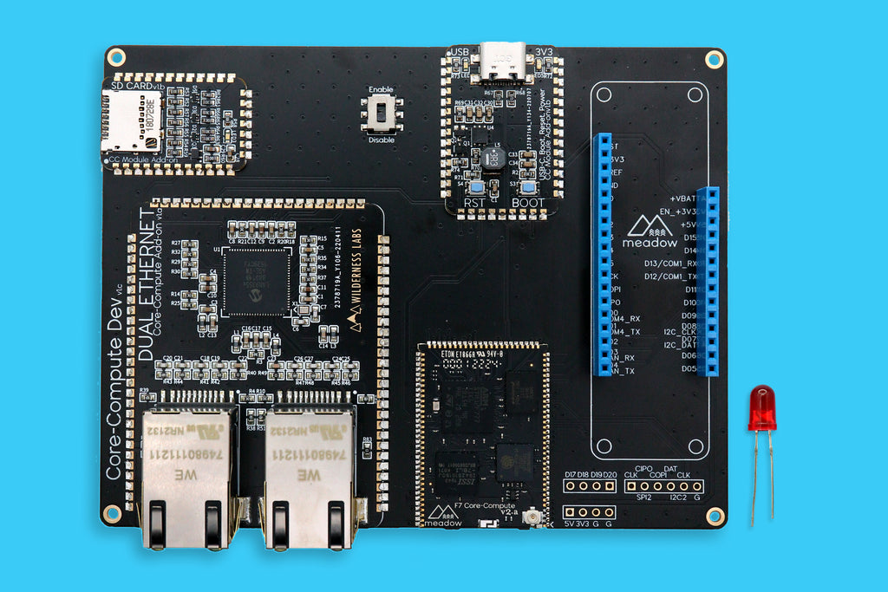

Getting started with the [Meadow Core-Compute module](https://store.wildernesslabs.co/collections/frontpage/products/meadow-f7v2-core-compute-module) is similar to getting started with a [Meadow Feather board](https://store.wildernesslabs.co/collections/frontpage/products/meadow-f7-feather), especially if you are working with the [Core-Compute Development Kit](https://store.wildernesslabs.co/collections/frontpage/products/meadow-f7v2-core-compute-breakout-board) which offers breakout headers that mimic the Feather headers.



If you are working with a bare Meadow Core-Compute module without the development kit, you will likely want to connect the castellated pins to peripherals to be able to move beyond logging or code-only projects. For production builds, the Core-Compute board on its own doesn't include an onboard LED to interact with.

1. Download and Install [Visual Studio](https://visualstudio.microsoft.com/) for either Windows or macOS to prepare your development machine. Community edition will work fine.
1. Use the Meadow.CLI to [deploy Meadow.OS to your board](/Meadow/Getting_Started/Deploying_Meadow/), booting the Core-Compute module into bootloader mode when you first connect it to your development machine.
1. Deploy your first Meadow application. You can start from a [Hello, Meadow](/Meadow/Getting_Started/Hello_World/) application, but you will need to connect external components or peripherals to recreate the experience of the onboard RGB LED. You will see logging output without any additional components.

    For a simple example, on the Core-Compute Development Kit, you could bridge an LED between the ground pin and pin **D15** and toggle it.

```csharp
using Meadow;
using Meadow.Devices;
using Meadow.Foundation.Leds;
using System;
using System.Threading.Tasks;

namespace HelloMeadow
{
    // Change F7FeatherV2 or F7FeatherV1 for Feather boards
    public class MeadowApp : App<F7CoreComputeV2>
    {
        Led led;

        public override Task Run()
        {
            Console.WriteLine("Run...");

            led.StartBlink(TimeSpan.FromSeconds(1), TimeSpan.FromSeconds(0.5));

            return base.Run();
        }

        public async override Task Initialize()
        {
            Console.WriteLine("Initialize...");

            led = new Led(Device.CreateDigitalOutputPort(Device.Pins.D15));

            await base.Initialize();
        }
    }
}
```

## Core-Compute pin details

When using the Core-Compute module within the Core-Compute Development Kit, some pins available via the Feather pin breakout headers have extra considerations. are reserved for use by other components on the development kit.

* **Pin D15 reserved**: Digital pin 15 on the Core-Compute module is reserved for SD card use.
* **Pin D16 available via D15 Feather header**: Since pin D15 is reserved for SD card use, on the Core-Compute Development Kit, pin **D16** from the Core-Compute module is made available through the Feather breakout header at the **D15** pin location. The pin available at that location is accessible from the `Device.Pins.D16` property, despite the label for Feather pinout consistency.

## Next steps

Now that you understand the basics of a Meadow application, we recommend learning about the following topics:

* [Hardware I/O](/Meadow/Meadow_Basics/IO/)
* [Meadow.Foundation](/Meadow/Meadow.Foundation/)

With the Core-Compute Development Kit, you can also explore the additional onboard peripherals, depending on your kit's configuration:

<!-- * [SD Card storage](/Meadow/Meadow.OS/Core-Compute_SD_Card/) -->
* SD Card storage (coming soon)
* [Networking](/Meadow/Meadow.OS/Networking/), accessible either via the Core-Compute Dual Ethernet add-on or wireless
