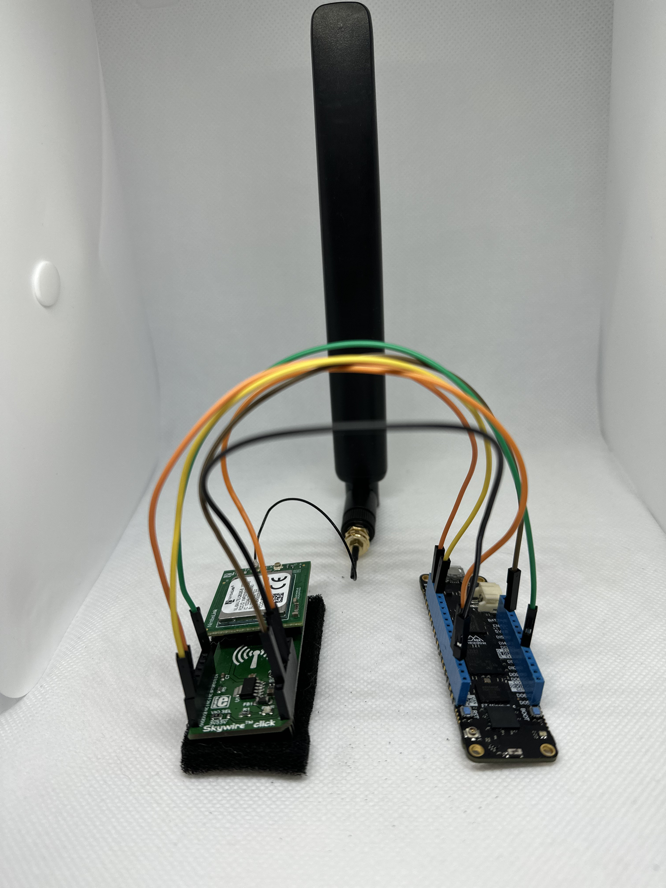
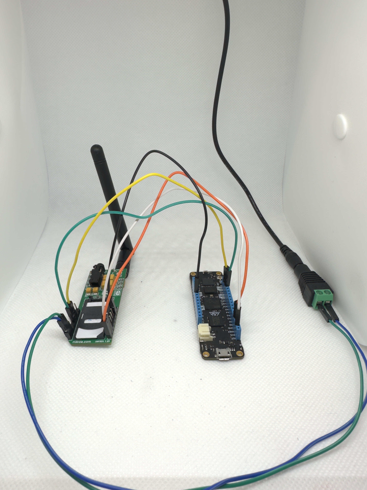

##  Cellular

The beta cellular network for the Meadow platform is compatible with various modules, each supporting different network operation modes. The following table describes the network operation modes supported by each module:

| Modules / Network Modes   | Cat-M1 (LTE-M or eMTC) | NB-IoT | GSM/GRPS 2G |
|--------------------------|------------------------|--------|-------------|
| Quectel BG770A Cell Wing | ✔                  | ✔  | -        |
| Quectel BG95-M3          | ✔                  | ✔  | ✔       |
| Quectel M95              | -                   | -   | ✔       |


**Cat-M1**, **NB-IoT**, and **GSM** (Global System for Mobile Communications) are all cellular network technologies with distinct characteristics. **GSM**, the most widely used cellular standard globally, provides higher data rates compared to **NB-IoT** and **Cat-M1** but has higher power consumption. In contrast, **Cat-M1** and **NB-IoT** are optimized for IoT applications. **Cat-M1** offers higher data rates and mobility, while **NB-IoT** provides ultra-low power consumption and extended coverage. The choice among **GSM**, **Cat-M1**, and **NB-IoT** depends on the specific requirements of the application, considering factors such as data rates, power consumption, and coverage area.


## Network configuration

Using Cellular Meadow, you don't need to understand the complexities of AT commands or invest time studying module datasheets to enable the cellular network interface.

You only need to create a **cell.config.yaml** file, where the cell settings will be defined, define the cell interface on the **meadow.config.yaml**, and reserve some pins used by the cell module.

Then, to configure your network you just need to follow these three steps:

1 - Create a **cell.config.yaml** and flash it to the device, here's an example:

```yaml
Settings:
    APN: virtueyes.com.br # Access Point Name
    Module: BG95M3 # Module model (BG770A, BG95M3 or M95)
    User: virtu # APN user (optional)
    Password: virtu # APN password (optional)
    Operator: 72410 # Carrier numeric operator code (optional)
    Mode: CATM1 # Network mode (CATM1, NBIOT or GSM) (optional)
    Interface: /dev/ttyS1 # Serial interface (UART1 (COM1) = /dev/ttyS0, UART4 (COM4) = /dev/ttyS1, UART6 = /dev/ttyS3) (optional)
    TurnOnPin: D10 # Pin used to turn on the Cell module (optional)
    ScanMode: false # Activate the cell network scanning mode (optional)
```

> **Notes**: If the carrier numeric operator code (**Operator**) or the network mode is not specified (**Mode**), the module will attempt to automatically determine the optimal network based on the M2M sim card inserted and your location. **However, if you encounter any connectivity issues, it is advisable to add the Operator to the cell config file**. If you don't know your operator code, you can use the **Cell Network Scanner**, included in that documentation, to find it out.

2 - Select `Cell` as `DefaultInterface` in the **meadow.config.yaml**, if you don't have this *yaml* file in your device, you should create and flash it to the device:

```yaml
Network:
    DefaultInterface: Cell
```

3 - Reserve the pins `I9` and `H13`, which are used to exchange data between the modem and the **Meadow F7v2 Feather**, and the `C7`, which is used to turn on the modules:

```yaml
Device:
    ReservedPins: I9;H13;C7
```

> **Notes**: You can find the pins `I9`, `H13` and `C7` as `D00`, `D01` and `D10` on the **Meadow F7v2 Feather**, respectively. If you use different pins, you should reserve the corresponding ones, according to the pinout definition present in the [**Meadow F7v2 Feather** datasheet](http://developer.wildernesslabs.co/Meadow/Meadow_Basics/Hardware/Wilderness_Labs_Meadow_F7v2_Datasheet.pdf). For instance, if you want to utilize the `A02` **Meadow F7v2 Feather** pin to turn on the module, you should reserve the corresponding `A3` MCU pin, instead of `C7`.

## Hardware configuration

To set up the hardware, the easiest way is to use our **BG770A Cell Wing** by attaching it to the **Meadow F7v2 Feather**. This provides a straightforward and hassle-free solution for establishing cellular connectivity. However, you can also use other cell click board models. All you need to do is connect the click boards to the **Meadow F7v2 Feather** using a few jumpers. To set up the hardware, follow the instructions based on your cell click board model:

### Quectel BG770A - Meadow Cell Wing
To utilize the **BG770A Cell Wing** with the **Meadow F7v2 Feather**, simply attach them, connect an LTE antenna (Rubber ducky or Dome) to the click board IPX connector, aiming for a preferred gain of 5 dBi (recommended) while ensuring a minimum gain of 2 dBi (required), and insert an **M2M** SIM card into the cell module.

{: .center-image :standalone}

<p align="center" style="font-size: smaller;">Quectel BG770A/Meadow Cell Wing with Meadow F7v2 Feather setup</p>

### Quectel BG95-M3 - NimbeLink Skywire click board
To configure the hardware, start by connecting the necessary jumpers for communication between the Meadow device and the cell module. Then make the necessary connections to supply and turn on the cell module. Finally, connect an antenna to the click board.

#### Connecting serial pins (UART)
To use this module you will need to connect the **Meadow F7v2 Feather** `D00` and `D01` pins to the `TX` and `RX` click board pins, respectively, to establish the data communication between them.

#### Power-up and supply pins
Also, you need to connect the **Meadow F7v2 Feather** `D10` pin to the `EN` **NimbeLink Skywire click board** pin. Additionally, connect the `3.3V`, `5V`, and `GND` pins from the **Meadow F7v2 Feather** to their corresponding pins on the click board.  If you are using another click board for the **BG95-M3** module, you need to connect the `D10` pin to the equivalent power-up pin.

#### Attaching an antenna
Finally, connect an LTE antenna (Rubber ducky or Dome) with the `X1` click board IPX connector, aiming for a preferred gain of 5 dBi (recommended) while ensuring a minimum gain of 2 dBi (required), and insert an **M2M** SIM card into the cell module.

{: .center-image :standalone}

<p align="center" style="font-size: smaller;">Quectel BG95-M3 click board with Meadow F7v2 Feather setup</p>

### Quectel M95 - GSM2 click board
To configure the hardware, start by connecting the necessary jumpers for communication between the Meadow device and the cell module. Then make the necessary connections to supply and turn on the cell module. Finally, connect an antenna to the click board.

#### Connecting serial pins (UART)
To use this module you will need to connect the **Meadow F7v2 Feather** `D00` and `D01` pins to the `TX` and `RX` click board pins, respectively, to establish the data communication between them.

#### Power-up and supply pins
Also, you need to connect the **Meadow F7v2 Feather** `D10` pin to the `PWK` **Quectel GSM2 click board** pin, to turn on the module. Additionally, connect the `3.3V` and `GND` pins from the **Meadow F7v2 Feather** to their corresponding pins on the click board. It's recommended to provide a 5V power supply to the click board `5V` and `GND` pins, since this module requires more energy than the LWPA modules (**BG95-M3** and **BG770A**). If you are using another click board for the **M95** module, you need to connect the `D10` pin to the equivalent power-up pin.

#### Attaching an antenna
Finally, establish a connection by attaching a GSM antenna (Rubber ducky) with an SMA Plug connector, aiming for a preferred gain of 5 dBi (recommended) while ensuring a minimum gain of 2 dBi (required), and insert a SIM card into the cell module.

{: .center-image :standalone}

<p align="center" style="font-size: smaller;">Quectel M95/GSM2 click board with Meadow F7v2 Feather setup using an external energy supply connected to the 5V and GND pins</p>

> **Notes**: To enable **Cat-M1** (LTE-M or eMTC) or **NB-IoT** network modes, a specialized **M2M** (Machine-to-Machine) SIM card is required, distinct from the standard SIM cards used in cellphones. However, for **GSM/GPRS 2G** connections, a standard SIM card can generally be used.

## Handling Cell connection using a .NET application

To check if you established a connection, you can use the `meadow listen` CLI command, which should return a message like this:
`Connection established successfully! IP address '100.69.106.222'.`

You can also check the Cell connection status by accessing the `IsConnected` property present in the `ICellNetworkAdapter`, as in the following example:

```csharp
var cell = Device.NetworkAdapters.Primary<ICellNetworkAdapter>();

if (cell.IsConnected)
{
    Console.WriteLine("Cell is connected!");
}
else
{
    Console.WriteLine("Cell isn't connected");
}
```

Therefore, you can use the `NetworkConnected` and `NetworkDisconnected` event handlers with Cell.

```csharp
var cell = Device.NetworkAdapters.Primary<ICellNetworkAdapter>();

cell.NetworkConnected += CellAdapter_NetworkConnected;
cell.NetworkDisconnected += CellAdapter_NetworkDisconnected;

void CellAdapter_NetworkConnected(INetworkAdapter networkAdapter, NetworkConnectionEventArgs e)
{
    Resolver.Log.Info("Cell network connected!");
}

void CellAdapter_NetworkDisconnected(INetworkAdapter networkAdapter)
{
    Resolver.Log.Info("Cell network disconnected!");
}

```

Besides that, you can get some extra information about the connection and the module, such as the Cell Signal Quality (CSQ), and the International Mobile Equipment Identity (IMEI).

```csharp
var cell = Device.NetworkAdapters.Primary<ICellNetworkAdapter>();

cell.NetworkConnected += CellAdapter_NetworkConnected;

void CellAdapter_NetworkConnected(INetworkAdapter networkAdapter, INetworkAdapter networkAdapter)
{
    Resolver.Log.Info("Cell network connected!");

    ICellNetworkAdapter cellAdapter = networkAdapter as ICellNetworkAdapter;
    if (cellAdapter != null)
    {
        Console.WriteLine("Cell CSQ: " + cellAdapter.Csq);
        Console.WriteLine("Cell IMEI: " + cellAdapter.Imei);
    }
}
```

> **Notes**: Before checking the Cell Quality Signal (CSQ) and module IMEI, ensure a successful connection has been established. The CSQ is a static value (0-31) representing the signal quality obtained on the connection. To convert this number to dBm, you need to use the formula: dBm = -113 + CSQ * 2 (where CSQ is the returned value).

## Troubleshooting
#### Scanning Cell networks

To connect using Cell, you can omit the operator code in `cell.config.yaml` and then the module will try to find an operator automatically. However, if you know the carrier code, **you can ensure that you are connecting to the right network, connecting faster and more reliably**. To find out the carrier code, you can use Cell network scanner by following these two steps:

1) Add the `ScanMode: true` in your `cell.config.yaml`, to let Cell in the scanning mode.
2) Use the `Scan` method, as in the example:

```csharp
using Meadow.Networking;
...

var cell = Device.NetworkAdapters.Primary<ICellNetworkAdapter>();

try
{
    CellNetwork[] operators = cell.Scan();

    foreach (CellNetwork operator in operators)
    {
        Console.WriteLine($"Operator Status: {operator.Status}, Operator Name: {operator.Name}, Operator: {operator.Operator}, Operator Code: {operator.Code}, Mode: {operator.Mode}");
    }
}
catch (Exception ex)
{
    Console.WriteLine("An error occurred: " + ex.Message);
}
```

> **Notes**: Some modules, such as the BG95-M3, memorize the last network mode used and consider it during scanning. For example, if you previously connected to an NB-IoT network, the scanner may return only the available NB-IoT networks. If you want to view available CAT-M1 networks, begin by connecting to this network initially, allowing the module to set CAT-M1 as network mode. Afterward, follow the steps mentioned above to initiate the scanner successfully.

#### Getting Cellular network connection logs
The cellular network connection logs might be helpful for users' troubleshooting. This raw data often holds valuable clues to help pinpoint and fix errors or connectivity issues. The following example will show how to get the cellular module AT commands output:

```csharp
using Meadow.Networking;
...

var cell = Device.NetworkAdapters.Primary<ICellNetworkAdapter>();

while (!cell.IsConnected)
{
    await Task.Delay(10000);
    Console.WriteLine($"Cell AT commands output: {cell.AtCmdsOutput}");
}
```