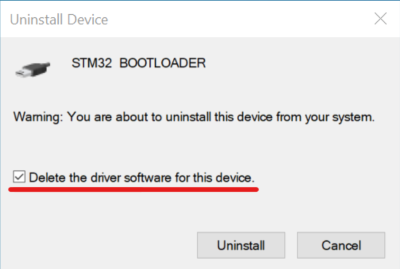

## Device not found

* First thing is to verify your device is in bootloader mode. To do this, connect the USB cable to the Meadow device while holding down the BOOT button.

* If you previously updated the STM32 BOOTLOADER driver from STTub30 to WinUSB through Zadig, you will need to uninstall the WinUSB driver since the Meadow extension uses the ST driver. Here are the steps to uninstall the WinUSB driver:
  1. Connect your device in bootloader mode.
  1. Open **Device Manager**.
  1. Find Universal Serial Bus devices > STM32 BOOTLOADER
  1. Right-click **STM32 BOOTLOADER** and select Uninstall Device
  1. In the Uninstall Device window, check **Delete the driver software for this device.** and click Uninstall  
  {:standalone}
  1. After uninstall is completed, the device will appear as **STM Device in DFU Mode** under Universal Serial Bus controllers.
  1. Now, try flashing the device again in Visual Studio.

## Which COM port do I use?

* After successfully flashing, the Meadow device shows up as **USB Serial Device (COMXX)** in Device Manager under Ports (COM & LPT). In the Meadow Device Explorer window in Visual Studio, select the appropriate **COMXX** port to target your Meadow device.

## Support

If you are still experiencing an issue, please [file a bug](https://github.com/WildernessLabs/VS_Win_Meadow_Extension/issues) or [join our public slack](http://slackinvite.wildernesslabs.co/) for support.
