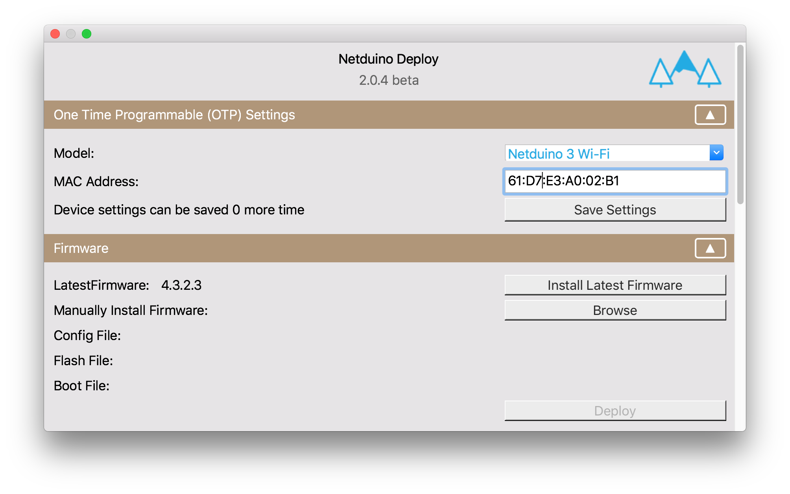
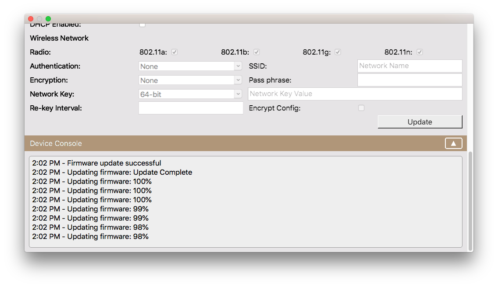

Ensuring that your Netduino has the latest firmware means that it will be up to date with the current Netduino-specific .NET Micro Framework runtime. Additionally, unless your Netduino has the latest firmware, you may have issues deploying your application to it.

You'll use the Netduino.Deploy tool for macOS or Windows to update your Netduino firmware.

## (Windows only) Install latest WinUSB.sys driver
 [Click here for instructions](https://github.com/WildernessLabs/Netduino-Updater/blob/master/bootloader_winusb_guide.md)

## Install the latest firmware

 1. Download [Netduino.Deploy](http://www.wildernesslabs.co/downloads) for either Windows or macOS.
 2. With your Netduino is unplugged, hold down the button and then plug it in to your computer. This puts the Netduino into _DFU Bootloader Mode_:
 
 3. Launch Netduino.Deploy, your Netduino should show up in the **Model** dropdown.
 
 4. Tap `Install Latest Firmware` to begin the update.
 5. You can monitor the firmware update progress at the bottom of **Netduino.Deploy** in the **Device Console** section.
 
 5. When it's done, you should reboot the Netduino before making additional changes.
 
## Manually install firmware from .hex or .s19 files

The Netduino.Deploy tool also enables manual firmware deployment:

 1. Follow steps 1, 2 & 3 above.
 2. Click the `Browse` button, and select either the `.hex` or `.s19`, `ER_CONFIG` and `ER_FLASH` files. 
 3. Click `Deploy` to deploy the firmware.

