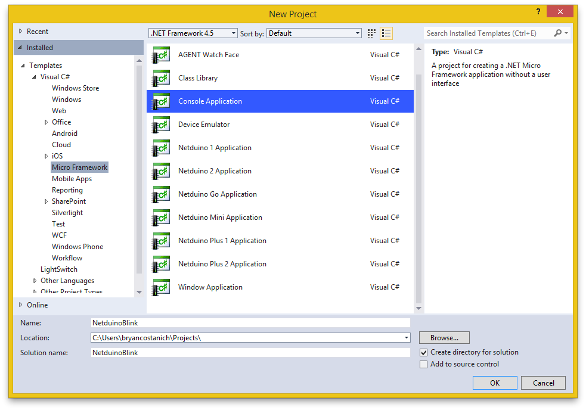
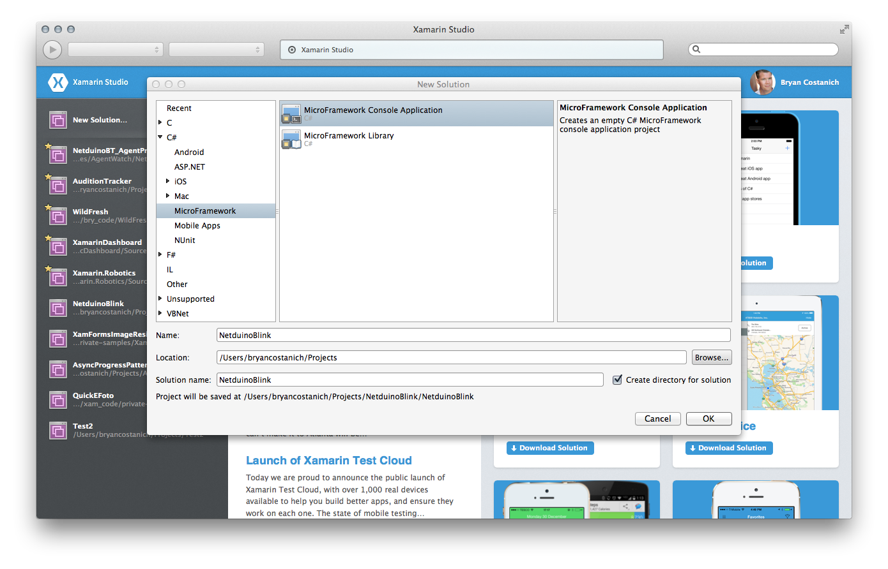

## Instructions

These instructions are valid for Netduino 2 and 3 boards.

### Step 1: Install Development Tools

 * [Windows Instructions](/Netduino/Getting_Started/Installation/Windows)
 * [Mac OS Instructions](/Netduino/Getting_Started/Installation/Mac)

### Step 2: Make Sure the Board Firmware is Up to Date

Once your development environment is configured, make sure your board has the latest firmware on it. The firmware includes a customized .NETMF runtime specific to the board hardware. Firmware update instructions are [here](../About/Updating_Firmware).

### Step 3: Create a new .NET MicroFramework App

#### Visual Studio for Windows

 1. Launch Visual Studio and create a new solution of type **Visual C### > Micro Framework > Console Application** and name it whatever you want:

 <figure markdown="1">
 
 </figure>

 2. Right-click on the **References** folder in the Solution Explorer and add:

     * Microsoft.Spot.Hardware
     * SecretLabs.NETMF.Hardware
     * SecretLabs.NETMF.Harware.Netduino (or NetduinoPlus if that's what you're using)

#### Visual Studio for mac

 1. Launch Xamarin Studio and create a new solution of type **C### > MicroFramework > MicroFramework Console Application** and name it whatever you want:

<figure markdown="1">

</figure>

 2. Double-click on the **References** folder in the Solution Pad and add:

    * Microsoft.Spot.Hardware
    * SecretLabs.NETMF.Hardware
    * SecretLabs.NETMF.Harware.Netduino

#### Add the Application Code

After you've created the project and configured the references, add the following code to your **Program.cs** file.

```csharp
using System;
using Microsoft.SPOT;
using Microsoft.SPOT.Hardware;
using System.Threading;
using SecretLabs.NETMF.Hardware.Netduino;

namespace NetduinoBlink
{
	public class Program
	{
		public static void Main()
		{
			// configure an output port for us to "write" to the LED
			OutputPort led = new OutputPort(Pins.ONBOARD_LED, false);
			// note that if we didn't have the SecretLabs.NETMF.Hardware.Netduino DLL, we could also manually access it this way:
			//OutputPort led = new OutputPort(Cpu.Pin.GPIO_Pin10, false);
			int i = 0;
			while (true)
			{
				led.Write(true); // turn on the LED
				Thread.Sleep(250); // sleep for 250ms
				led.Write(false); // turn off the LED
				Thread.Sleep(250); // sleep for 250ms

				Debug.Print ("Looping" + i);
				i++;
			}

		}
	}
}
```

This code does the following things:

 1. It creates an `OutputPort`. An `OutputPort` allows you to "write" to a pin, e.g. power it on or off.
 2. Loops forever: writing to the port to turn on, then waiting 250ms, then turning it off.
 3. Prints to the **Debug Window** the loop iteration it's on.

#### Deploy


##### Visual Studio for Windows

 1. Make sure your Netduino is plugged in.

 2. Double-click on the **Properties** item in the Solution Explorer, select **.NET Micro Framework** on the left, and the under **Deployment** choose **USB** and in the **Device** drop down, choose your Netduino device:
  <figure markdown="1">
 
</figure>
 3. Click the **Start >** button in the toolbar to deploy to your device.

The app should deploy and after a moment, the LED should start blinking on the Netduino:
 <figure markdown="1">

</figure>

##### Visual Studio for Mac

 1. Make sure your Netduino is plugged in. It should show up in the build bar at the top:
  <figure markdown="1">

</figure>
 2. Hit the ">" button to deploy.

The app should deploy and after a moment, the LED should start blinking on the Netduino:
 <figure markdown="1">

</figure>
You should also see the debug output in the **Application Output** window:

```
Deploy: Deploying assemblies to device
Deploy: Deploying assemblies for a total size of 560 bytes
Deploy: Assemblies successfully deployed to device.

...
Looping0
Looping1
Looping2
Looping3
```

## [Next - Check out Netduino.Foundation](http://netduino.foundation)

Netduino.Foundation makes creating Netduino applications easier by providing a huge library of hardware peripheral drivers and a handcrafted API to use them. Check it out at [Netduino.Foundation](http://netduino.foundation).

<br/>

| Project       | Image |
|---------------|-------|
| [Polyphonic Netduino Music Player](https://www.hackster.io/wilderness-labs/polyphonic-netduino-music-player-3b3843) |  |
| [Christmas Counter Using a LCD Display, RTC and Netduino](https://www.hackster.io/wilderness-labs/christmas-counter-using-a-lcd-display-rtc-and-netduino-696a46) |  |
| [Make a Night Light Using a PIR sensor, RGB LED and Netduino](https://www.hackster.io/wilderness-labs/make-a-night-light-using-a-pir-sensor-rgb-led-and-netduino-7224e5) |  |
| [Expanding IO Ports of a Netduino with a 74HC595](https://www.hackster.io/wilderness-labs/expanding-io-ports-of-a-netduino-with-a-74hc595-ddabf1) |  |
| [Working with DisplayGraphics on a SPI Display on a Netduino](https://www.hackster.io/wilderness-labs/working-with-displaygraphics-on-a-spi-display-on-a-netduino-b2a646) | _B5SxWzG0so.gif) |
| [Build a Netduino Polyphonic Piano with a Keypad and Piezos](https://www.hackster.io/wilderness-labs/build-a-netduino-polyphonic-piano-with-a-keypad-and-piezos-d19fca) |  |
| [Build Your Own Memory Game with Netduino](https://www.hackster.io/wilderness-labs/build-your-own-memory-game-with-netduino-9e9480) |  |
| [Monitor a Plant's Soil Moisture with Netduino and Xamarin!](https://www.hackster.io/wilderness-labs/monitor-a-plant-s-soil-moisture-with-netduino-and-xamarin-f3fe96) |  |
| [Expanding IO Ports of a Netduino with an MCP23008](https://www.hackster.io/wilderness-labs/expanding-io-ports-of-a-netduino-with-an-mcp23008-137c63) |  |
| [Build Your Own Simon Game with Netduino](https://www.hackster.io/wilderness-labs/build-your-own-simon-game-with-netduino-cd60ab) |  |
| [Play Soccer with Netduino Using Servos and Push Buttons](https://www.hackster.io/wilderness-labs/play-soccer-with-netduino-using-servos-and-push-buttons-2d8168) |  |
| [Remote Control a Servo Using Netduino and Xamarin!](https://www.hackster.io/wilderness-labs/remote-control-a-servo-using-netduino-and-xamarin-117e39) |  |
| [Remote Control an RGB LED via Netduino and Xamarin!](https://www.hackster.io/wilderness-labs/remote-control-an-rgb-led-via-netduino-and-xamarin-7329f8) |  |
| [Show Rainbow Colors with an RGB LED and Netduino](https://www.hackster.io/wilderness-labs/show-rainbow-colors-with-an-rgb-led-and-netduino-5dd7b6) |  |
| [Netduino Pulse-Width-Modulation LED Project](https://www.hackster.io/wilderness-labs/netduino-pulse-width-modulation-led-project-cb4922) |  |
| [Getting Started with Netduino by Controlling the Onboard LED](https://www.hackster.io/wilderness-labs/getting-started-with-netduino-by-controlling-the-onboard-led-72775e) |  |
