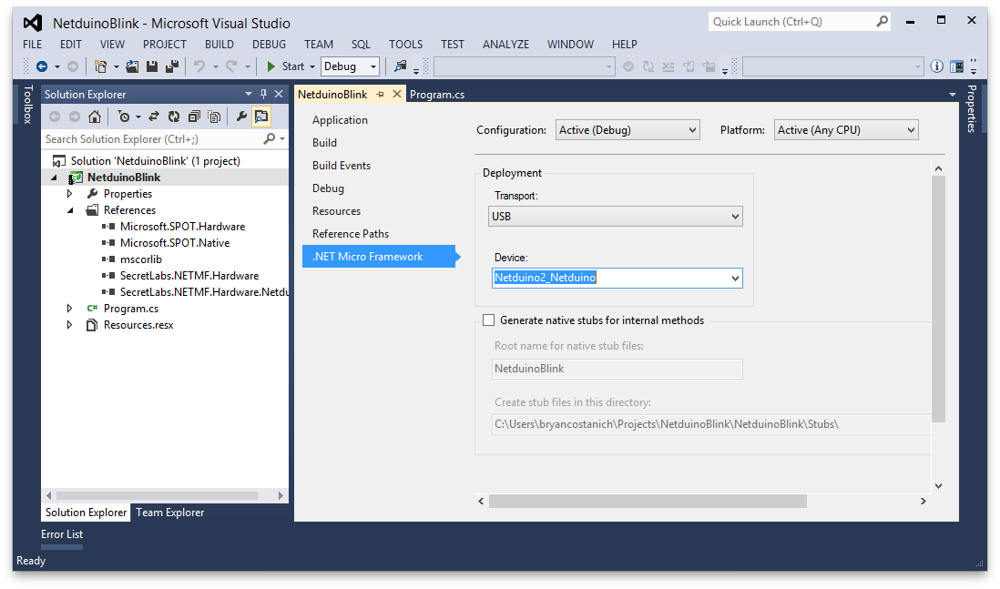

# Instructions

These instructions are valid for Netduino 2 and 3 boards.

## Step 1: Install Development Tools

 * [Windows Instructions](/Netduino/Getting_Started/Installation/Windows)
 * [Mac OS Instructions](/Netduino/Getting_Started/Installation/Mac)

## Step 2: Make Sure the Board Firmware is Up to Date

Once your development environment is configured, make sure your board has the latest firmware on it. The firmware includes a customized .NETMF runtime specific to the board hardware. Firmware update instructions are [here](../About/Updating_Firmware).

## Step 3: Create a new .NET MicroFramework App
 	
### Visual Studio for Windows

 1. Launch Visual Studio and create a new solution of type **Visual C# > Micro Framework > Console Application** and name it whatever you want:
 {:standalone}
 
 2. Right-click on the **References** folder in the Solution Explorer and add:
 
     * Microsoft.Spot.Hardware
     * SecretLabs.NETMF.Hardware
     * SecretLabs.NETMF.Harware.Netduino (or NetduinoPlus if that's what you're using)

### Visual Studio for mac

 1. Launch Xamarin Studio and create a new solution of type **C# > MicroFramework > MicroFramework Console Application** and name it whatever you want:
{:standalone}

 2. Double-click on the **References** folder in the Solution Pad and add:
 
    * Microsoft.Spot.Hardware
    * SecretLabs.NETMF.Hardware
    * SecretLabs.NETMF.Harware.Netduino

### Add the Application Code

After you've created the project and configured the references, add the following code to your **program.cs** file.

```csharp
using System;
using Microsoft.SPOT;
using Microsoft.SPOT.Hardware;
using System.Threading;
using SecretLabs.NETMF.Hardware.Netduino;

namespace NetduinoBlink
{
	public class Program
	{
		public static void Main()
		{
			// configure an output port for us to "write" to the LED
			OutputPort led = new OutputPort(Pins.ONBOARD_LED, false); 
			// note that if we didn't have the SecretLabs.NETMF.Hardware.Netduino DLL, we could also manually access it this way:
			//OutputPort led = new OutputPort(Cpu.Pin.GPIO_Pin10, false); 
			int i = 0;
			while (true) 
			{ 
				led.Write(true); // turn on the LED 
				Thread.Sleep(250); // sleep for 250ms 
				led.Write(false); // turn off the LED 
				Thread.Sleep(250); // sleep for 250ms 

				Debug.Print ("Looping" + i);
				i++;
			} 

		}
	}
}
```

This code does the following things:

 1. It creates an `OutputPort`. An `OutputPort` allows you to "write" to a pin, e.g. power it on or off.
 2. Loops forever, writing to the port on, then waiting 250ms, then turning it off.
 3. Prints to the **Debug Window** the loop iteration it's on.

### Deploy

 
#### Visual Studio for Windows

 1. Make sure your Netduino is plugged in.
  	
 2. Double-click on the **Properties** item in the Solution Explorer, select **.NET Micro Framework** on the left, and the under **Deployment** choose **USB** and in the **Device** drop down, choose your Netduino device:
 {:standalone}

 3. Click the **Start >** button in the toolbar to deploy to your device.
 
The app should deploy and after a moment, the LED should start blinking on the Netduino:

{:standalone}{:standalone}


#### Visual Studio for Mac

 1. Make sure your Netduino is plugged in. It should show up in the build bar at the top:
{:standalone}

 2. Hit the ">" button to deploy.
 
The app should deploy and after a moment, the LED should start blinking on the Netduino:

{:standalone}{:standalone}

You should also see the debug output in the **Application Output** window:

```
Deploy: Deploying assemblies to device
Deploy: Deploying assemblies for a total size of 560 bytes
Deploy: Assemblies successfully deployed to device.

...
Looping0
Looping1
Looping2
Looping3
```

# [Next - Check out Netduino.Foundation](http://netduino.foundation)

Netduino.Foundation makes creating Netduino applications easier by providing a huge library of hardware peripheral drivers and a handcrafted API to use them. Check it out at [Netduino.Foundation](http://netduino.foundation).

<br/>