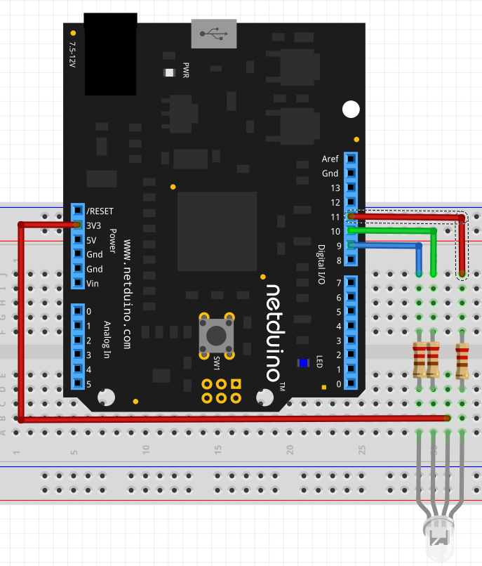

This sample cycles an [RGB LED](https://www.sparkfun.com/products/105) through the rainbow, by looping through all possible hues in the visible color spectrum. 

It works by using the [Additive Color](https://www.wikiwand.com/en/Additive_color) mixing model in which the three primary colors, _red_, _green_, and _blue_, are added in varying amounts to create various colors.

# Code

```csharp
using System;
using System.Threading;
using Microsoft.SPOT;
using Microsoft.SPOT.Hardware;
using SecretLabs.NETMF.Hardware;
using SecretLabs.NETMF.Hardware.Netduino;

namespace RgbLed
{
    /// <summary>
    /// This program illustrates how to drive an RGB LED with a Pulse-Width Modulation
    /// Signal.
    /// </summary>
    public class Program
    {
        public static void Main()
        {            
            PWM redLed = new PWM (PWMChannels.PWM_PIN_D11, 100, 0, false);
            PWM greenLed = new PWM (PWMChannels.PWM_PIN_D10, 100, 0, false);
            PWM blueLed = new PWM (PWMChannels.PWM_PIN_D9, 100, 0, false);

            double dutyCycleMax = .3; // RGB Led doesn't seem to get much brighter than at 30%
 
            while (true) 
            {
                redLed.Start ();
                greenLed.Start ();
                blueLed.Start ();

                double r, g, b;

                for (int i = 0; i < 360; i++) {
                    HsvToRgb(i, 1, 1, out r, out g, out b);

                    redLed.DutyCycle = (r * dutyCycleMax);
                    greenLed.DutyCycle = (g * dutyCycleMax);
                    blueLed.DutyCycle = (b * dutyCycleMax);

                    // for a fun, fast rotation through the hue spectrum:
                    //Thread.Sleep (1);
                    // for a gentle walk through the forest of colors;
                    Thread.Sleep (18);
                }
            }
        }

        /// <summary>
        /// HSV to rgb. Note that for RGB LED use, you probably want a constant 100% brightness. This doesn't do that. 
        /// For that Algorithm, check out: https://blog.adafruit.com/2012/03/14/constant-brightness-hsb-to-rgb-algorithm/
        /// </summary>
        /// <param name="hue">Hue in degress (0-359º).</param>
        /// <param name="saturation">Saturation.</param>
        /// <param name="brightValue">Brightness value.</param>
        /// <param name="r">The red component. (0-1)</param>
        /// <param name="g">The green component. (0-1)</param>
        /// <param name="b">The blue component. (0-1)</param>
        static void HsvToRgb(double hue, double saturation, double brightValue, out double r, out double g, out double b)
        {
            double H = hue;
            double R, G, B;

            // hue parameter checking/fixing
            if (H < 0 || H >= 360)
            {
                H = 0;
            }
            // if Brightness is turned off, then everything is zero.
            if (brightValue <= 0)
            {
                R = G = B = 0;
            }

            // if saturation is turned off, then there is no color/hue. it's grayscale.
            else if (saturation <= 0)
            {
                R = G = B = brightValue;
            }
            else // if we got here, then there is a color to create.
            {
                double hf = H / 60.0;
                int i = (int)System.Math.Floor(hf);
                double f = hf - i;
                double pv = brightValue * (1 - saturation);
                double qv = brightValue * (1 - saturation * f);
                double tv = brightValue * (1 - saturation * (1 - f));

                switch (i)
                {

                    // Red Dominant
                    case 0:
                        R = brightValue;
                        G = tv;
                        B = pv;
                        break;

                    // Green Dominant
                    case 1:
                        R = qv;
                        G = brightValue;
                        B = pv;
                        break;
                    case 2:
                        R = pv;
                        G = brightValue;
                        B = tv;
                        break;

                    // Blue Dominant
                    case 3:
                        R = pv;
                        G = qv;
                        B = brightValue;
                        break;
                    case 4:
                        R = tv;
                        G = pv;
                        B = brightValue;
                        break;

                    // Red Red Dominant
                    case 5:
                        R = brightValue;
                        G = pv;
                        B = qv;
                        break;

                    // In case the math is out of bounds, this is a fix.
                    case 6:
                        R = brightValue;
                        G = tv;
                        B = pv;
                        break;
                    case -1:
                        R = brightValue;
                        G = pv;
                        B = qv;
                        break;

                    // If the color is not defined, go grayscale
                    default:
                        R = G = B = brightValue;
                        break;
                }
            }
            r = Clamp(R);
            g = Clamp(G);
            b = Clamp(B);
        }

        /// <summary>
        /// Clamp a value to 0 to 1
        /// </summary>
        static double Clamp(double i)
        {
            if (i < 0) return 0;
            if (i > 1) return 1;
            return i;
        }
    }
}

```

# Hardware

A common anode LED should be connected to the Netduino as follows:

{:standalone}

# [Netduino Samples Github Repository](https://github.com/WildernessLabs/Netduino_Samples)

Full source code for all of the samples can be found in the Netduino Samples repository on Github.